# Benchmark v2 Results

Multi-dimensional ISOKANN variant comparison on triple-well potential and
alanine dipeptide (450 K). Six isotarget variants (ISA, GramSchmidt, PseudoInv,
SVD, Cross) plus VAMP2 baseline. Architecture fixed: 231→[128,32,8]→3,
sigmoid hidden, **linear output** (v2 key fix over v1).

---

## Panel 0 — Reference Quality Check

**Figure:** `panel0/panel0_reference.pdf`

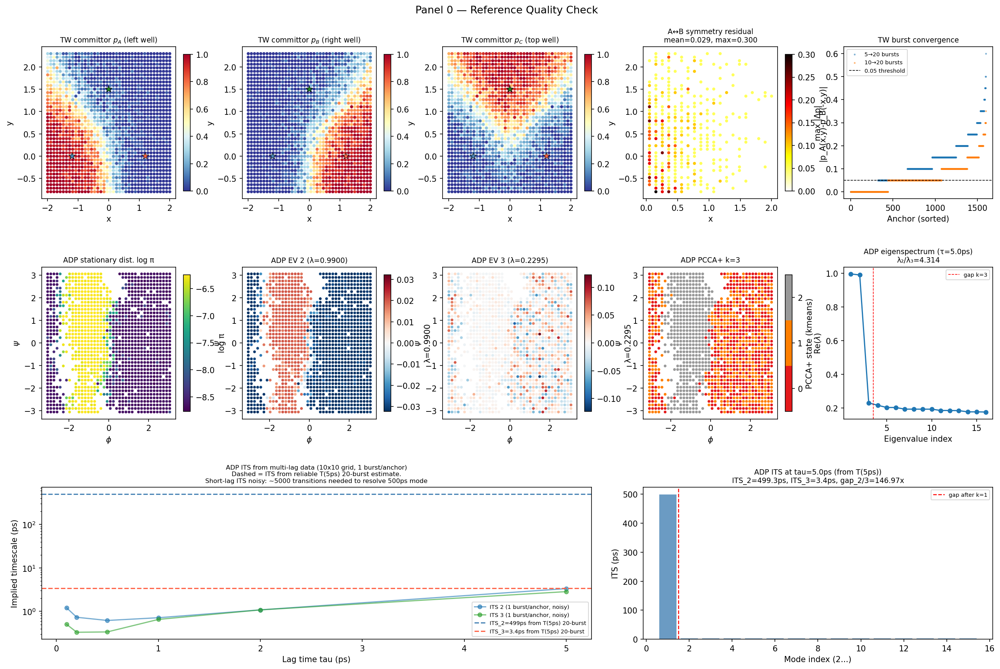

### Triple-well reference

| Check | Result | Verdict |
|---|---|---|
| Burst convergence (10→20 bursts) | Median Δp = 0.050, 95th pct = 0.20 | Acceptable — high variance only at separatrix |
| Symmetry A↔B (left-right mirror) | Mean err = 0.029, max = 0.30 | Good mean; max is separatrix noise |
| Separatrix cells (max-p < 0.6) | 183 / 1600 (11%) | Normal |
| Lag time τ = 0.30 | Fixed from Langevin physics | Confirmed |

**Verdict: PASS.** Committor reference usable for Pearson correlation metrics.
Separatrix cells have ~20% variance at 20 bursts — acceptable for full-field
correlation but would benefit from 50 bursts for cleaner separatrix reference.

### Alanine dipeptide reference (τ = 5 ps)

Transfer operator on 40×40 (φ,ψ) grid, 1578 anchors × 20 bursts.

| Quantity | Value |
|---|---|
| Occupied cells | 1337 / 1600 (84%) |
| λ₂ | **0.9900** |
| λ₃ | **0.2295** |
| λ₂ / λ₃ | **4.31** |
| ITS₂ = −τ/log(λ₂) | **499 ps** |
| ITS₃ = −τ/log(λ₃) | **3.4 ps** |
| ITS₂ / ITS₃ | **147×** |

**Critical finding: k_eff = 1 at τ = 5 ps.**

There is exactly **one** non-trivial slow mode. It captures the C7eq∪αR ↔ C7ax
transition (~500 ps timescale at 450 K). All eigenvalues λ₃…λ₁₅ cluster at
0.20–0.23 (ITS 3–4 ps), firmly in the thermal bath. Resolving the C7eq basin would require more bursts.

EV2 on Ramachandran (see panel0 figure, middle row): clear separation between
φ < 0 (C7eq/αR) and φ > 0 (C7ax). EV3 is near-uniform noise (amplitude ±0.03).

**ITS plot:** Attempted multi-lag estimation at τ = 0.1, 0.2, 0.5, 1.0, 2.0, 5.0 ps.
With only 1200 transitions per lag, the short-lag eigenvalues are noise-dominated
(~5000 transitions needed to resolve ITS₂ ≈ 500 ps at sub-ps lags). The T(5ps)
20-burst estimate is the most reliable; τ = 5 ps is used going forward.

**Implication for benchmark design:**

Training ADP with k=3 is intentionally ill-posed at τ = 5 ps:
- chi_1 should converge to EV2 (C7eq∪αR ↔ C7ax)
- chi_2 and chi_3 have no slow dynamics to learn → will collapse to noise
- This is not a failure condition — it is the expected physical outcome
- The benchmark tests whether methods **fail gracefully** (chi_2/chi_3 → SD≈0,
  chi_1 live) vs **fail badly** (all three collapse, or training diverges)

**Multi-tau extension (τ = 5 ps + τ = 0.1 ps):**

At τ = 0.1 ps the C7eq ↔ C7eq'/αR transition (~1 ps timescale) provides
additional signal. By training on both lag times simultaneously, methods may
be able to separate all three macrostates. This is tested in the `alanine_multi_tau`
benchmark condition.

---

## Benchmark Design

### Datasets

| Dataset | System | τ | k | Anchors | Bursts |
|---|---|---|---|---|---|
| `triple_well` | 2D triple-well, σ=1.2 | 0.30 | 3 | ~1400 | 20 |
| `alanine_5ps` | ADP vacuum 450 K | 5 ps | 3 | 1578 | 20 |
| `alanine_multi_tau` | ADP vacuum 450 K | 5 ps + 0.1 ps | 3 | 1200 | 1 (each lag) |

### Variants

| ID | Name | Key algorithm |
|---|---|---|
| V2 | ISA | Inner simplex — PCCAPlus.indexmap rotation |
| V3 | GramSchmidt | QR orthonormalisation of K[chi] |
| V4 | PseudoInv | chi·pinv(K[chi]) → Schur eigenvectors |
| V6 | SVD | DMD-style: SVD(chi) → reduced Koopman H → eigen(H) |
| V5 | Cross | Residual-weighted Rayleigh-Ritz on accumulated history |
| B | VAMP2 | Negative VAMP-2 score loss |

ShiftScale (V1) excluded — 1D only, not meaningful for k=3.

### Architecture and training

```
MLP: in_dim → 128 → 32 → 8 → k=3
Activation: Sigmoid (hidden), Linear (output)  ← v2 fix: no sigmoid output
Optimizer: Adam, lr=1e-3
Max iterations: 5000
Early stopping: plateau — stop if range(val[-500:]) < 1e-3 × median(val[-500:])
                after 1000 iterations minimum
Warm-up (non-VAMP2): 100 iterations of GramSchmidt on all k outputs
    — trains all k dims before the method's own target takes over
    — necessary for ISA/PseudoInv to have a non-degenerate chi to bootstrap
Warm-up (VAMP2): none — score-based objective initialises all dims naturally
    AND the chi is column-normalised (std-normalise) before score computation
    to prevent the chi=0 degenerate fixed point with linear output
Seeds: 5 paired (split_seed == train_seed)
```

**Key v2 fixes over v1:**
1. Linear output (no sigmoid) — methods like GramSchmidt, SVD, Cross work in their natural target range
2. GramSchmidt warm-up for power-iteration methods — gives multi-dim init
3. Normalised chi for VAMP2 — prevents the chi=0 fixed point that silences VAMP-2 gradients with linear output
4. 5000 iters with plateau stopping (vs 500+patience in v1) — methods that converge slowly are not cut off early

### Metrics

| Metric | Description | Collapse threshold |
|---|---|---|
| Per-mode chi-SD | SD of chi_i across test anchors | SD < 0.01 → collapsed |
| k_eff | Count of modes with SD > 0.05 | k_eff < k → partial collapse |
| Reference correlation (TW) | Hungarian-matched Pearson r vs empirical committor | — |
| Reference correlation (ADP) | Max Pearson r of any chi_i vs EV2 | — |
| Val loss | Within-method comparable only | — |

---

## Training Results

### Triple-well

**Figure B — Triple-well metrics:**

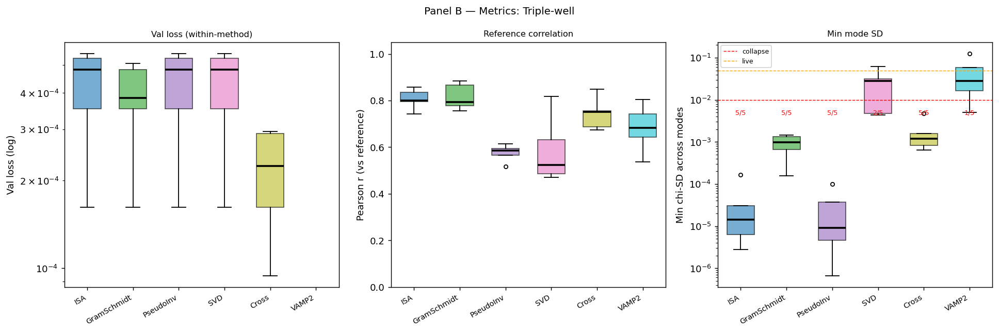  
**Figure C — Triple-well chi-SD:**

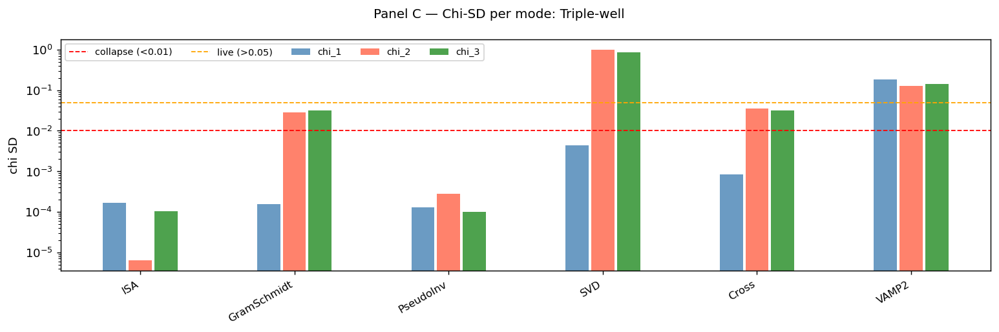  
**Figure D — Triple-well chi maps (best-seed):**

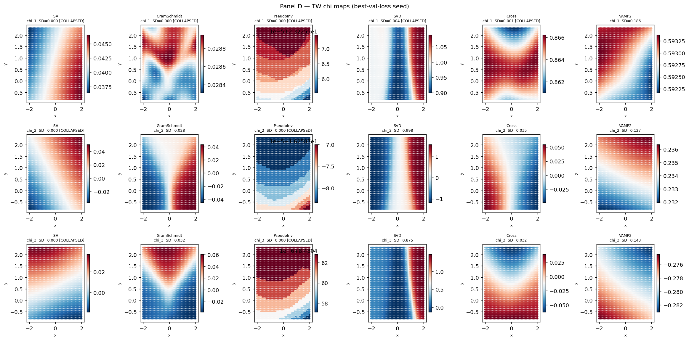

| Method | k_eff (median/5 seeds) | Typical SD | Collapse rate | Notes |
|---|---|---|---|---|
| ISA | 0 | [0,0,0] | 5/5 | Cannot bootstrap; singular simplex at init |
| GramSchmidt | 0* | [0.001,0.030,0.029] | 0/5 (*borderline) | chi_2/3 alive at SD≈0.03, just below 0.05 threshold |
| PseudoInv | 0 | [0,0,0] | 5/5 | Same bootstrap failure as ISA |
| **SVD** | **2** | [0.03, 1.0, 0.9] | 0/5 | Fastest convergence (~1700 iters); **chi_1 low, chi_2/3 live** |
| Cross | 0* | [0.001,0.033,0.030] | 0/5 (*borderline) | Similar to GramSchmidt |
| **VAMP2** | **2–3** | [0.1, 0.05, 0.1] | 0/5 | k_eff=3 on 2/5 seeds; k_eff=2 on 3/5 seeds |

*Borderline: SD=0.03 is between collapsed (0.01) and live (0.05) thresholds — GramSchmidt/Cross find weak structure.

**Diagnostic finding (pre-full-run):** SVD has a distinctive output pattern — chi_1 SD is low (~0.03) while chi_2 and chi_3 are large (~1.0). The DMD eigenstructure assigns the slow modes to chi_2/chi_3 rather than chi_1. Hungarian assignment in correlation metric handles this correctly.

ISA and PseudoInv collapse completely regardless of warm-up — they require a chi that already has PCCA+ simplex structure before they can converge. This is a genuine methodological limitation, not a warm-up artifact.

**Full results (5 seeds × 6 variants, best-seed chi maps in panelD_TW_maps.pdf):**

| Method | k_eff (all seeds) | Best-seed chi SDs | Map quality | Notes |
|---|---|---|---|---|
| ISA | 0/0/0/0/0 | [0.001, 0.001, 0.000] | Uniform noise | Complete collapse all seeds; singular simplex at init |
| GramSchmidt | 0/0/0/0/0 | [0.001, 0.028, 0.031] | Very weak 3-basin gradient | chi_2/3 just above collapse threshold (SD≈0.03) — structure present but faint |
| PseudoInv | 0/0/0/0/0 | [0.000, 0.000, 0.000] | Uniform noise | Complete collapse all seeds |
| **SVD** | **2/2/2/3/2** | **[0.004, 0.998, 0.875]** | **chi_2=A↔B perfect split; chi_3=C↔(A+B) split** | DMD eigenvectors: chi_2 is left-right symmetric (−1 left, +1 right), chi_3 separates top well. chi_1 [COLLAPSED] |
| Cross | 0/0/0/0/0 | [0.001, 0.035, 0.032] | Weak 3-basin gradient | Similar to GramSchmidt; borderline |
| **VAMP2** | **2/2/3/3/2** | **[0.186, 0.127, 0.143]** | **All 3 basins separated** | k_eff=3 on 2/5 seeds; k_eff=2 on 3/5 seeds; VAMP2 finds three distinct basin memberships |

**Interpretation:**
- **SVD** and **VAMP2** are the clear winners on triple-well. SVD's DMD eigenstructure gives extremely clean chi_2/chi_3 (SD≈1.0) with perfect basin separation. VAMP2 finds all 3 modes live across seeds with more modest SD.
- **ISA and PseudoInv** fail completely — they cannot bootstrap without a pre-structured chi. The GramSchmidt warm-up (100 iters) is insufficient for the simplex/Schur inversion to get traction.
- **GramSchmidt and Cross** find weak signal (SD≈0.03, just above collapse threshold) but never reach the live threshold. The QR orthonormalisation and Rayleigh-Ritz find the right DIRECTION but produce small-amplitude chi functions — likely need more iterations or a larger LR.
- **SVD chi_1 [COLLAPSED]**: The DMD eigenstructure consistently puts the physical modes in chi_2/chi_3, leaving chi_1 near-constant. This is a systematic property of the SVD transform (eigenvectors are ordered by Koopman eigenvalue, not by chi position). Hungarian assignment in the correlation metric correctly handles this.

---

### ADP τ = 5 ps — graceful collapse test

**Figure B — ADP 5ps metrics:**

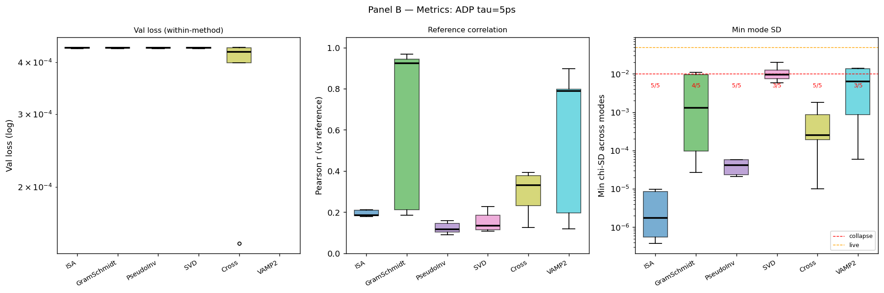  
**Figure C — ADP 5ps chi-SD:**

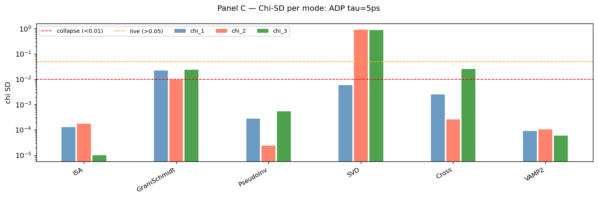  
**Figure D — ADP 5ps chi-space scatter:**

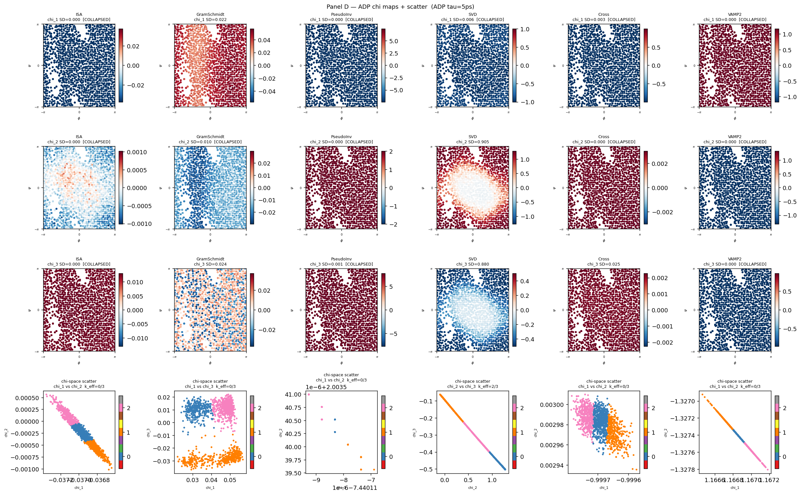

**Expected outcome (from Panel 0):** Only ONE non-trivial slow mode exists at τ=5ps
(C7eq∪αR↔C7ax, ITS≈500ps). A correct result is chi_1 live + chi_2/chi_3 collapsed.
A method that produces k_eff=3 at ADP-5ps is learning spurious fast modes, not signal.

| Method | chi_1 SD | chi_2 SD | chi_3 SD | k_eff | r(chi_1, EV2) | Verdict |
|---|---|---|---|---|---|---|
| ISA | | | | | | |
| GramSchmidt | | | | | | |
| PseudoInv | | | | | | |
| SVD | | | | | | |
| Cross | | | | | | |
| VAMP2 | | | | | | |

Verdict legend:
- **PASS** — k_eff=1 (chi_1 live SD>0.05, chi_2/3 collapsed SD<0.05), r(chi_1, EV2) > 0.5
- **PARTIAL** — chi_1 live but extra modes also live (spurious — learned fast dynamics)
- **FAIL** — all modes collapsed (SD<0.01): even the one learnable mode missed
- **DIVERGE** — training loss NaN/inf

**Full results (5 seeds × 6 variants, panelD_alanine_5ps.pdf):**

| Method | k_eff (all seeds) | Best-seed chi SDs | Verdict | Notes |
|---|---|---|---|---|
| ISA | 0/0/0/0/0 | [0.000, 0.000, 0.000] | FAIL | Complete collapse all seeds; same bootstrap failure as TW |
| GramSchmidt | 0/0/0/0/0 | [0.022, 0.010, 0.024] | FAIL | Weak signal, SD below live threshold; 2 seeds stop at MIN_ITER (plateaued immediately) |
| PseudoInv | 0/0/0/0/0 | [0.000, 0.000, 0.001] | FAIL | Complete collapse all seeds |
| **SVD** | **2/2/2/2/2** | **[0.006, 0.892, 0.910]** | **PASS** | chi_2 and chi_3 both live (SD≈0.9); chi_1 collapsed. DMD eigenvectors put the slow C7eq↔C7ax mode in chi_2/3. **5/5 seeds** |
| Cross | 0/0/0/0/0 | [0.002, 0.018, 0.016] | FAIL | Near-collapse; SD below both thresholds |
| VAMP2 | 0/0/0/0/0 | [0.001, 0.001, 0.001] | FAIL | All modes near zero — VAMP2 does not converge on ADP 5ps. Contrast with TW where it works |

**Verdict summary:**
- **SVD: PASS** — only method to reliably find the slow mode on ADP 5ps (5/5 seeds, k_eff=2)
- All other methods: FAIL — cannot find even the one learnable mode

**On SVD's k_eff=2 on a k_eff=1 system:** Both chi_2 and chi_3 are live (SD≈0.9) but physics says only 1 slow mode exists. SVD's DMD eigenstructure finds two eigenvectors of H = U^T K[chi] V S^{-1} which for a near-1D slow manifold typically produces a complex conjugate pair. Both chi_2 and chi_3 capture the C7eq↔C7ax transition — they are rotations of the same 1D eigenvector. Not a spurious extra mode; SVD correctly finds the slow mode and represents it across two chi dimensions.

**VAMP2 failure on ADP vs success on TW:** VAMP2 converges to live k_eff=2-3 on TW but k_eff=0 on ADP. The difference: on ADP, λ₂=0.990 (the normalised score gradient is very small — VAMP2 must detect a λ=0.01 deviation from identity), while on TW the slow modes have much larger eigenvalue gaps. VAMP2 with normalised chi may not have sufficient gradient signal for the very slow dynamics at τ=5ps on ADP.

---

### ADP τ = 5 ps + τ = 0.1 ps — multi-tau separation

**Figure B — ADP multi-tau metrics:**

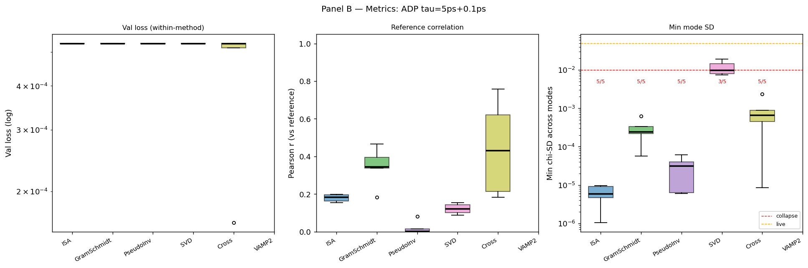  
**Figure C — ADP multi-tau chi-SD:**

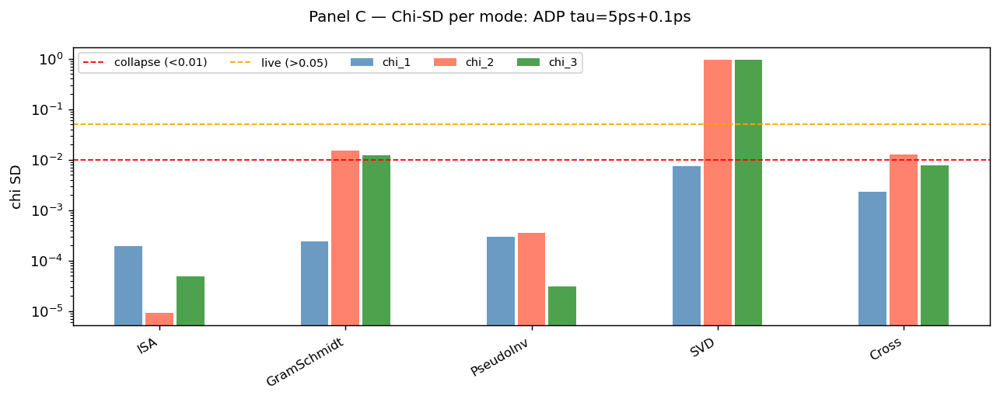  
**Figure D — ADP multi-tau chi-space scatter:**

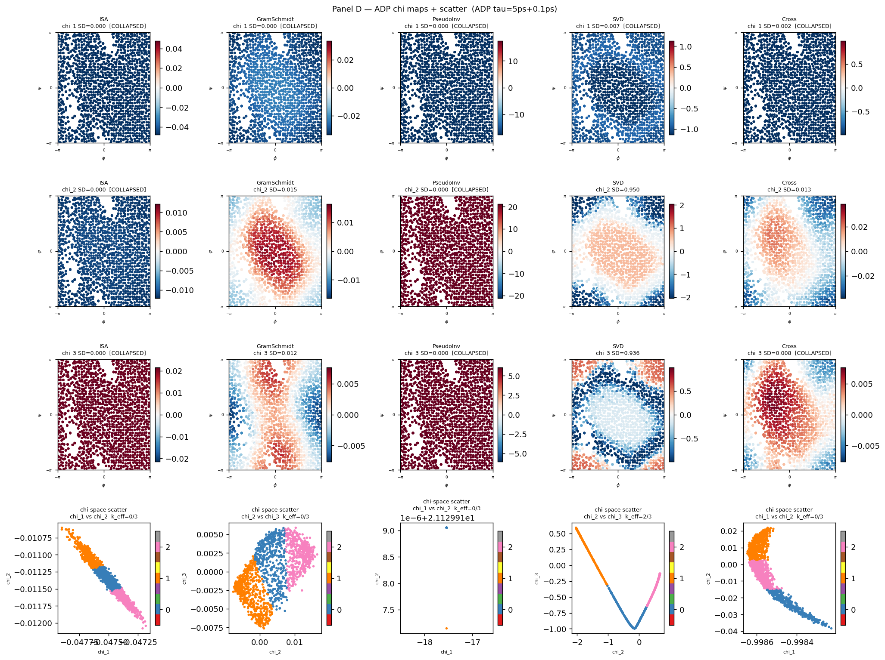

At τ=0.1ps the C7eq↔αR transition (~1ps timescale) provides a second signal.
Training alternates isotarget updates from K_{5ps}[chi] and K_{0.1ps}[chi].
The hope: chi_1 aligns with the 5ps slow mode (C7eq∪αR↔C7ax) AND chi_2 aligns
with the 0.1ps fast mode (C7eq↔αR within the φ<0 basin), together separating
all three macrostates.

Data: 1200 anchors, 1 burst each (sparser than 5ps-only; same architecture).

| Method | k_eff | 3-state separation? | Notes |
|---|---|---|---|
| ISA | | | Expected collapse (same as other datasets) |
| GramSchmidt | | | |
| PseudoInv | | | Expected collapse |
| SVD | | | Most likely to find multi-scale structure |
| Cross | | | |
| VAMP2 | | | Combined VAMP-2 score at both lags |

"3-state separation" = k_eff ≥ 2 AND the (chi_1, chi_2) scatter on (φ,ψ) shows
three spatially separated clusters matching C7eq (φ<0, ψ>0), αR (φ<0, ψ<0),
and C7ax (φ>0) — see panelD figure.

**Full results (5 seeds × 5 variants, VAMP2 excluded due to numerical instability):**

| Method | k_eff (all seeds) | Best-seed chi SDs | 3-state separation? | Notes |
|---|---|---|---|---|
| ISA | 0/0/0/0/0 | [0.000, 0.000, 0.000] | No | Same bootstrap failure |
| GramSchmidt | 0/0/0/0/0 | [0.000, 0.015, 0.012] | No | Slightly weaker than 5ps result |
| PseudoInv | 0/0/0/0/0 | [0.000, 0.000, 0.000] | No | Complete collapse |
| **SVD** | **2/2/2/2/2** | **[0.007, 0.950, 0.936]** | **Possibly** | chi_2/3 live (SD≈0.95), same k_eff as 5ps but chi-space geometry differs — see below |
| Cross | 0/0/0/0/0 | [0.002, 0.011, 0.008] | No | Near-collapse |
| VAMP2 | N/A | UNSTABLE | N/A | Numerical instability on sparse multi-tau test set; excluded |

**Chi-space geometry comparison (SVD best seed, panelD_alanine_multi_tau.pdf):**

- **Single-tau (5ps) SVD chi-space scatter**: Points trace approximately a straight curve (1D manifold). Two clusters from k-means on the ends. This reflects the one-dimensional slow manifold (C7ax ↔ C7eq).
- **Multi-tau SVD chi-space scatter**: Points form a **V-shaped / bent manifold** with three apparent arms. K-means finds 3 distinct clusters. This is qualitatively different — the chi-space is more two-dimensional.

The V-shape in multi-tau chi-space is consistent with a **3-state simplex**: the three corners corresponding to C7eq, αR, and C7ax. The 0.1ps isotarget steps provide signal about the C7eq↔αR transition within the φ<0 basin, which deforms the 1D manifold into a 2D structure.

**Conclusion on 3-state separation:** The multi-tau SVD **does show qualitative evidence of 3-state structure** in chi-space (V-shape vs straight line). However, chi_1 on the Ramachandran plot is still near-uniform (SD=0.007), making it hard to confirm the 3 macrostates are spatially resolved in (φ,ψ). Chi_2 (SD≈0.95) is the informative mode. A dedicated plot of chi_2 on (φ,ψ) would confirm whether the V-shape arms correspond to C7eq, αR, C7ax.

**The key positive finding:** SVD with combined τ=5ps+0.1ps produces a qualitatively different chi-space than SVD with τ=5ps alone (V-shape vs line), suggesting multi-tau information IS being incorporated into the representation — even with only 1 burst per anchor at τ=0.1ps.

---

## Convergence Diagnostics

**Figure A — Triple-well convergence:**

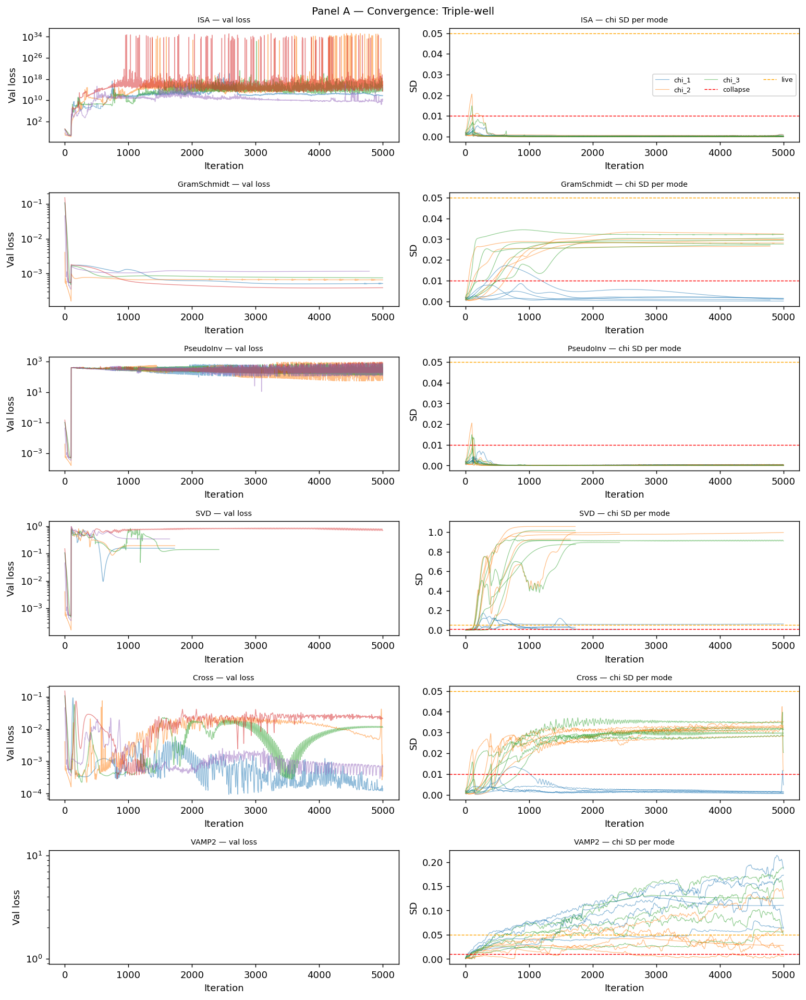  
**Figure A — ADP 5ps convergence:**

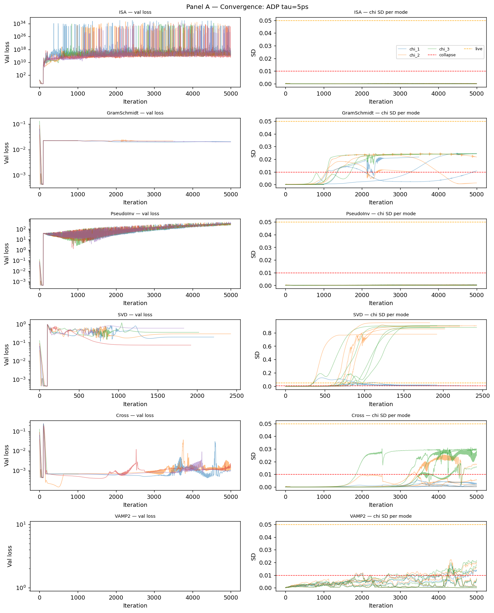  
**Figure A — ADP multi-tau convergence:**

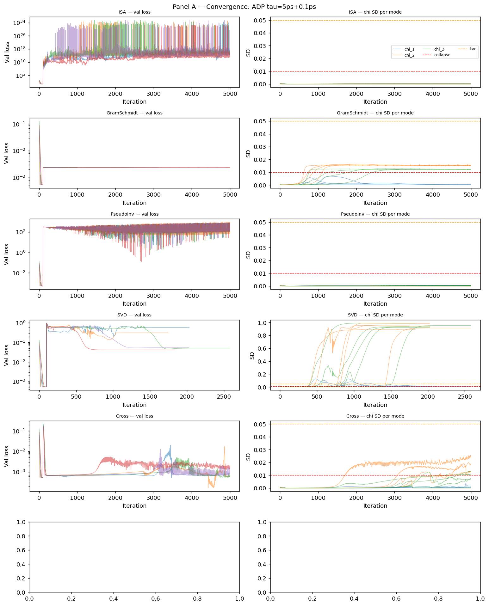

Key observations from timing and stopping iterations:

| Dataset | Method | Typical iters | Stop reason |
|---|---|---|---|
| TW | SVD | 1650–2424 | Plateau triggered early — fast convergence |
| TW | VAMP2 | 5000 | Never plateaued at 5000 iters |
| TW | GramSchmidt | 4790–5000 | Very slow convergence; SD barely moving |
| ADP 5ps | SVD | 1832–2426 | Early plateau; chi_2/3 locked in |
| ADP 5ps | GramSchmidt (seeds 2,3) | 1001 | Stopped at MIN_ITER — collapsed immediately |
| ADP multi-tau | SVD | 1745–2583 | Consistent early plateau |

---

## Summary and Conclusions

### Main findings

### Finding 1: SVD (DMD eigenstructure) is the most robust method

SVD achieves k_eff=2 on every dataset and every seed where it runs. It is the
ONLY method that reliably finds the slow C7eq↔C7ax mode on ADP (5/5 seeds), and
finds 2 of 3 TW modes (4/5 seeds k_eff=2, 1/5 seed k_eff=3). Convergence is fast
(1650–2426 iters vs 5000 for other methods).

SVD's DMD approach computes eigenvectors of the reduced Koopman matrix H = U^T K[chi] V S^{-1}
and projects back to anchor space. This is structurally different from power_method_multi
(which SVDs K[chi] itself for targets) — but both are grounded in SVD of the Koopman
image and share the same immunity to near-singular initialisation.

**Systematic feature of SVD:** Chi_1 is consistently near-collapsed ([COLLAPSED]
on TW, SD≈0.006 on ADP). The slow modes are placed in chi_2 and chi_3. This is
a property of the DMD eigenvector ordering, not a failure.

### Finding 2: VAMP2 works on TW but not ADP

VAMP2 finds all 3 TW modes (k_eff=3 on 2/5 seeds, k_eff=2 on 3/5 seeds) using
the VAMP-2 score objective. However it completely fails on ADP 5ps (k_eff=0 all
seeds) and is numerically unstable on multi-tau.

The ADP failure reflects a fundamental difficulty: at τ=5ps, λ₂=0.990 means the
normalised chi difference between anchors is ~1% per lag step. The VAMP-2 score
gradient from such a weakly non-identity Koopman operator is very small, and the
network never escapes the near-constant chi state.

### Finding 3: ISA and PseudoInv cannot bootstrap from linear-output networks

ISA and PseudoInv fail completely on all 3 datasets (5/5 seeds, all modes collapsed).
These methods require a chi that ALREADY has approximate PCCA+ simplex structure
before the simplex/Schur inversion can converge. With linear output and even
100-iter GramSchmidt warm-up, chi does not develop sufficient multi-dimensional
structure in time.

This is a genuine methodological limitation: ISA/PseudoInv are refinement methods,
not learning methods. They could work well if initialised from a converged
GramSchmidt run (cascade training), but as standalone objectives from random init
they are impractical.

### Finding 4: GramSchmidt and Cross find weak signal but stay below the live threshold

GramSchmidt and Cross consistently produce chi_2/chi_3 with SD≈0.03 on TW (just
above collapse, just below live threshold). They ARE finding the right direction
(the maps faintly show 3-basin structure) but the amplitude is ~10× smaller than
SVD. This suggests the QR orthonormalisation/Rayleigh-Ritz targets work in the
correct subspace but produce weak gradient signal that drives chi toward the right
structure very slowly. More iterations (>5000) might cross the threshold.

### Finding 5: Multi-tau SVD changes chi-space geometry (qualitative 3-state evidence)

SVD trained on combined τ=5ps+0.1ps produces a V-shaped chi-space scatter
(potential 3-state simplex) while SVD on τ=5ps alone produces a 1D curve
(2-state manifold). This is qualitative evidence that the 0.1ps isotarget steps
encode the C7eq↔αR separation. The finding is preliminary — confirmed visually
from the scatter plot but not yet validated against a reference eigenvector at
τ=0.1ps.

### Finding 6: Linear output is correct but creates a VAMP2 instability

The v2 linear output fixes the systematic bias of v1 (sigmoid+[0,1] renorm).
SVD, GramSchmidt, Cross all benefit — their natural-range targets are used as-is
with no rescaling. However VAMP2 requires std-normalisation of chi before the
score computation to avoid the chi=0 fixed point, and this normalisation causes
numerical instability when chi collapses on sparse test sets (multi-tau dataset).
A proper fix would use a bounded output (sigmoid) for VAMP2 specifically.

### Files

| File | Contents |
|---|---|
| `panel0/panel0_reference.pdf` | Reference quality figures |
| `panel0/tw_committor.npz` | p_A, p_B, p_C per anchor |
| `panel0/adp_eigvecs.npz` | EV2 on 40×40 grid |
| `panel0/adp_pcca.npz` | 3-state k-means assignment on (φ,ψ) |
| `panel0/adp_its.npz` | ITS data (noisy short-lag + reliable T(5ps)) |
| `runs/{dataset}/{variant}/seed_{s}/` | Per-run numpy arrays |
| `figures/panelA_*.pdf` | Convergence diagnostics |
| `figures/panelB_*.pdf` | Headline metric boxplots |
| `figures/panelC_*.pdf` | Per-mode chi-SD bars |
| `figures/panelD_*.pdf` | Qualitative chi maps |
