# Benchmark v4 — multi-D ISOKANN on vacuum alanine dipeptide (300 K)

Genuine multi-process vacuum ADP, three lag conditions. Reference = the **0.1 ps** transfer-operator slow eigenvectors (lag-independent CV shapes; 0.1 ps resolves both cleanly):

- **φ-flip** C7eq/αR↔C7ax (EV2).
- **ψ-process** C7eq↔αR (EV3) — λ=0.985 at 0.1 ps (ITS≈6.5 ps), but only λ=0.27 at 5 ps (nearly relaxed). The fast process is far easier to see at short lag in the *operator* — the test is whether ISOKANN can learn it.

k=3, 231 pairwise distances, one burst/anchor per lag (multitau = K=2: a 5 ps AND a 0.1 ps burst per anchor). Score = Hungarian mean |r| of the 3 χ to {EV2,EV3}; also max|r| vs φ/ψ; k_eff = χ with SD>0.05.

| Variant | lag | seeds | r (Hung φ,ψ) | SD | max r vs φ | max r vs ψ | k_eff |
|---------|-----|-------|--------------|----|-----------|-----------|-------|
| ISA (no warm-up) | 5 ps | 3 | 0.324 | ±0.050 | 0.279 | 0.391 | 0.0 |
| ISA (no warm-up) | 0.1 ps | 3 | 0.538 | ±0.229 | 0.436 | 0.640 | 1.0 |
| GramSchmidt | 5 ps | 3 | 0.512 | ±0.003 | 0.969 | 0.055 | 3.0 |
| GramSchmidt | 0.1 ps | 3 | 0.670 | ±0.190 | 0.970 | 0.369 | 3.0 |
| SVD-Power | 5 ps | 3 | 0.431 | ±0.060 | 0.676 | 0.245 | 1.7 |
| SVD-Power | 0.1 ps | 3 | 0.499 | ±0.097 | 0.399 | 0.773 | 3.0 |
| GramSchmidt→ISA | 5 ps | 3 | 0.184 | ±0.178 | 0.354 | 0.018 | 1.0 |
| GramSchmidt→ISA | 0.1 ps | 3 | 0.710 | ±0.153 | 0.623 | 0.803 | 3.0 |
| ShiftScale→ISA | 5 ps | 3 | 0.361 | ±0.010 | 0.260 | 0.463 | 0.0 |
| ShiftScale→ISA | 0.1 ps | 3 | 0.592 | ±0.205 | 0.454 | 0.729 | 2.0 |

## Reference (0.1 ps transfer-operator eigenvectors)

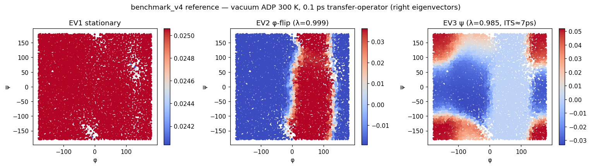

## χ maps + validation — 5 ps

### ISA (no warm-up) — 5 ps

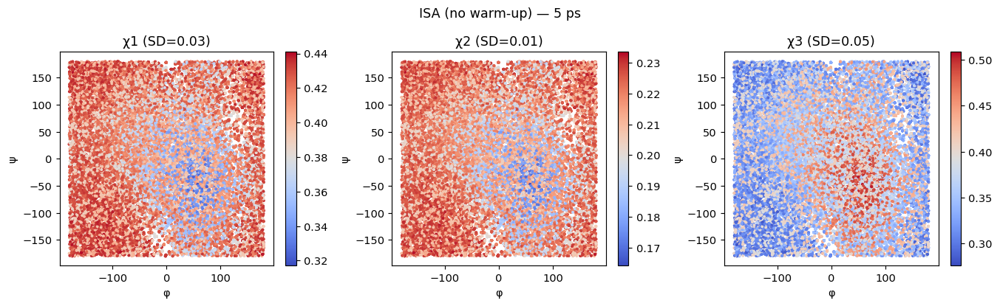

### GramSchmidt — 5 ps

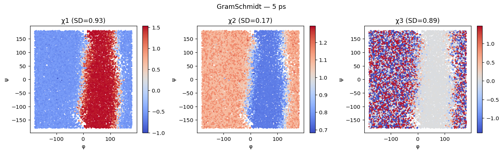

### SVD-Power — 5 ps

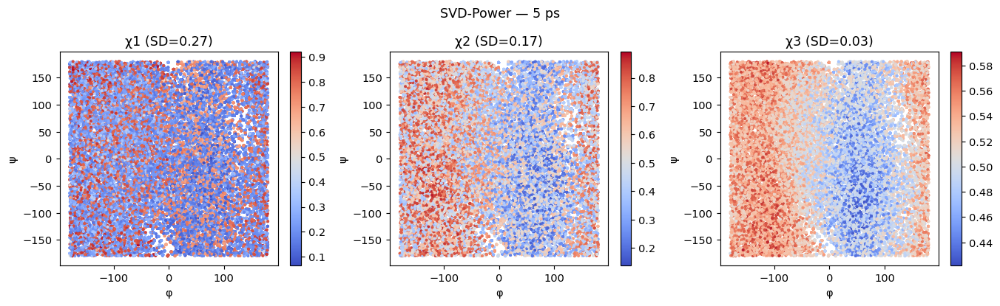

### GramSchmidt→ISA — 5 ps

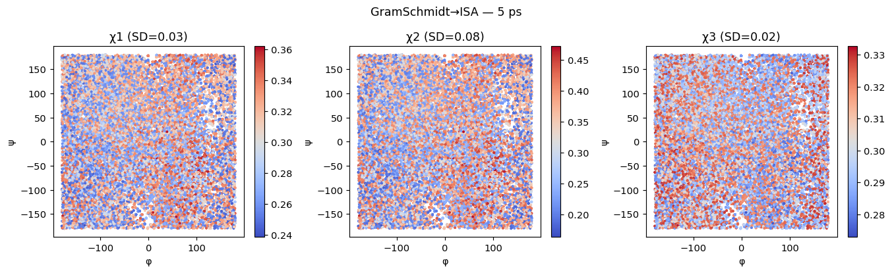

### ShiftScale→ISA — 5 ps

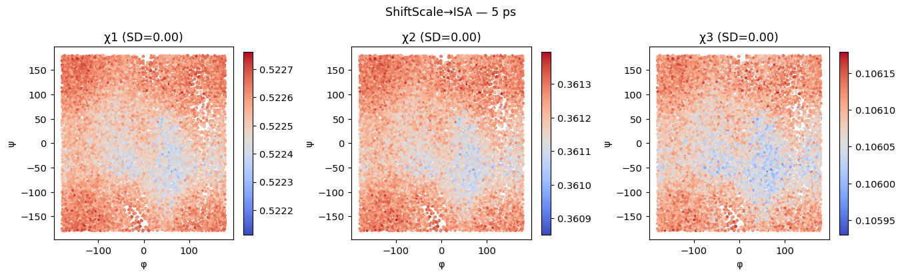

### validation loss — 5 ps

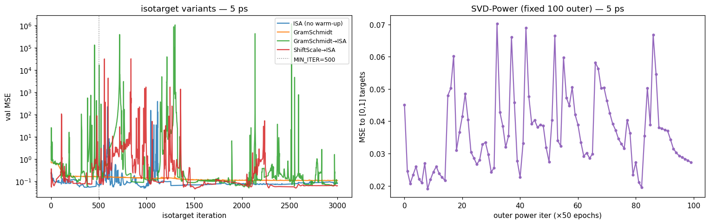

## χ maps + validation — 0.1 ps

### ISA (no warm-up) — 0.1 ps

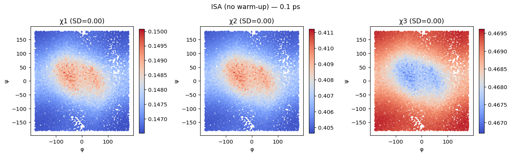

### GramSchmidt — 0.1 ps

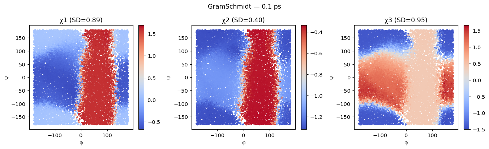

### SVD-Power — 0.1 ps

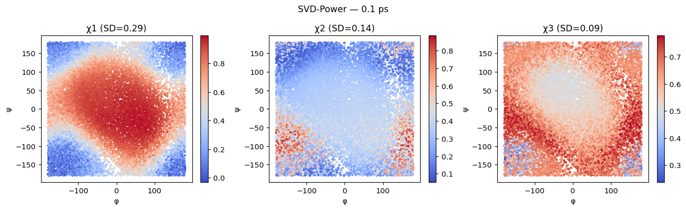

### GramSchmidt→ISA — 0.1 ps

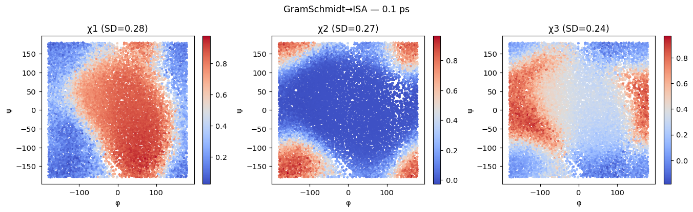

### ShiftScale→ISA — 0.1 ps

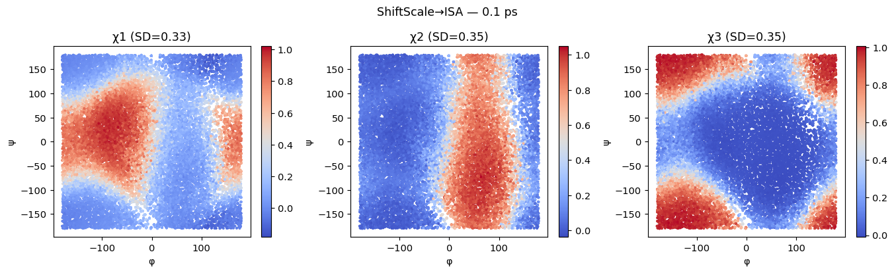

### validation loss — 0.1 ps

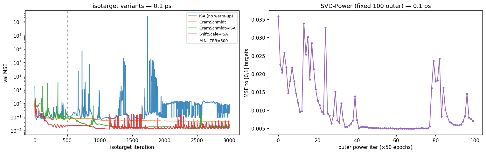
